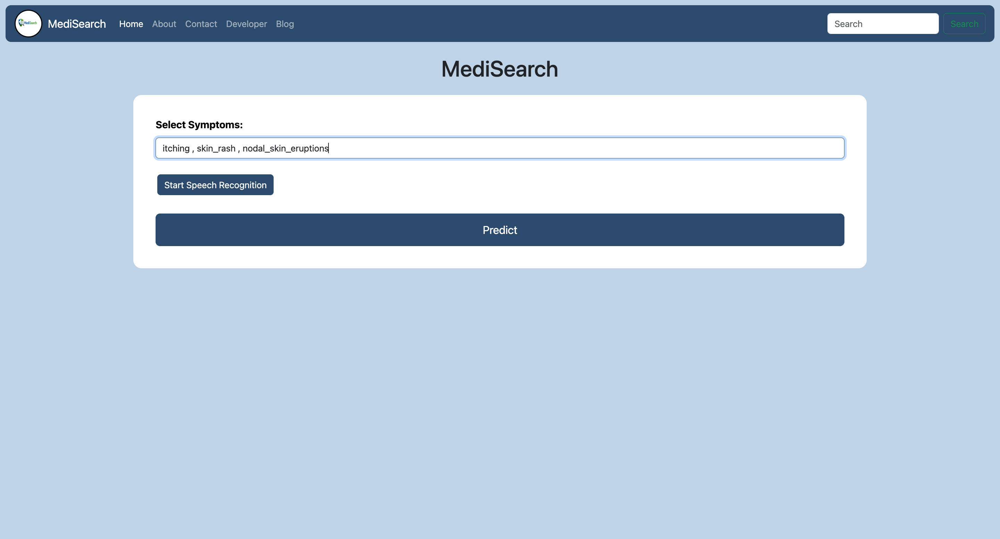
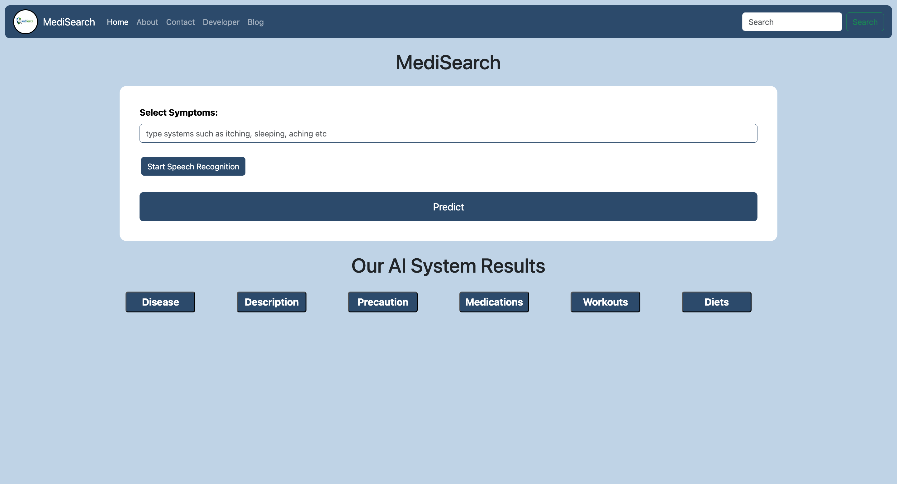
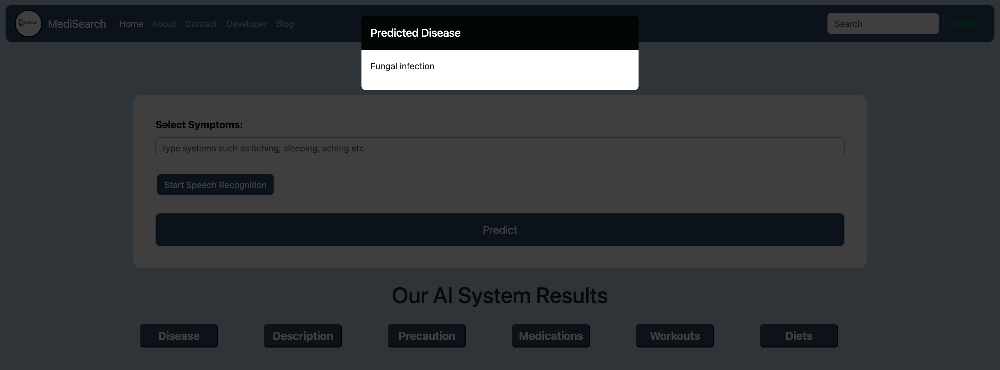
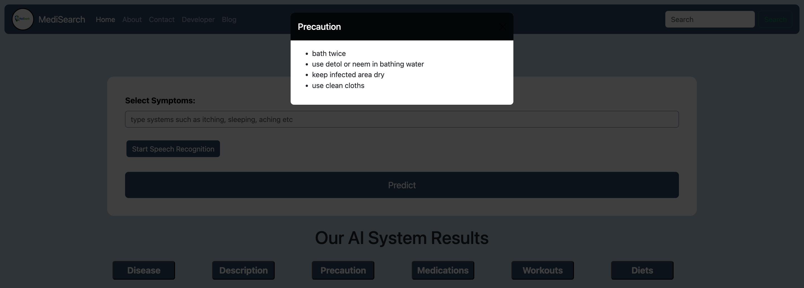
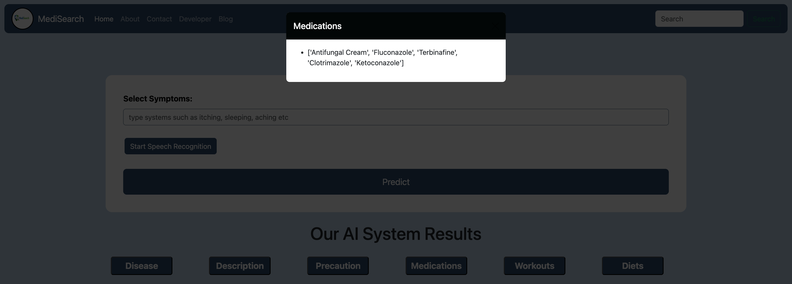
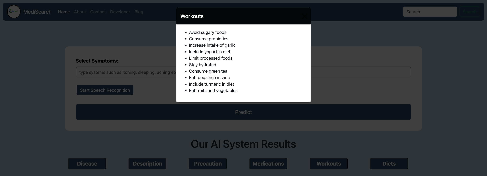
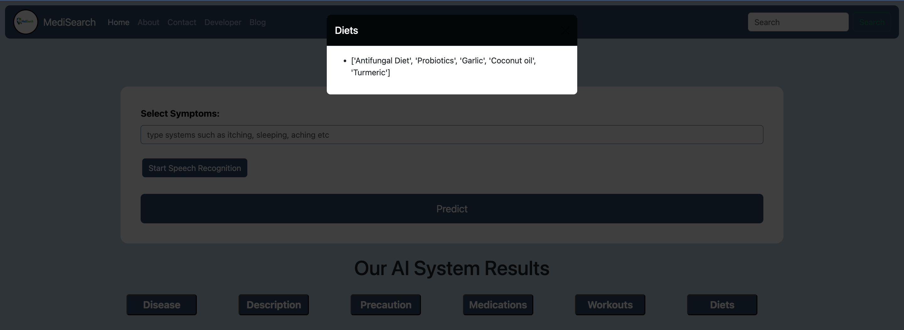

<!-- # Personalized-Medical-Recommendation-System-with-Machine-Learning
Welcome to our cutting-edge Personalized Medical Recommendation System, a powerful platform designed to assist users in understanding and managing their health. Leveraging the capabilities of machine learning, our system analyzes user-input symptoms to predict potential diseases accurately. Here's what sets our system apart:

User-Friendly Interface: Our intuitive interface allows users to input their symptoms effortlessly, creating a seamless user experience.

Advanced Machine Learning Models: We've integrated state-of-the-art machine learning models that accurately predict diseases based on input symptoms, ensuring reliable and precise results.

Tailored Recommendations: Receive personalized recommendations for the top 5 medicines, prescription details, and even workout routines based on the predicted disease.

Flask App Integration: The entire system is powered by a Flask web application, making it easily accessible to users. Experience the convenience of accessing healthcare recommendations from anywhere.

Privacy and Security: We prioritize user privacy and data security. Your health information is handled with the utmost confidentiality, adhering to the highest industry standards.

Continuous Improvement: Our system is designed for continuous improvement. As we gather more data, the machine learning models evolve, providing increasingly accurate and relevant recommendations.

Take charge of your health with our Personalized Medical Recommendation System. Your well-being is our priority, and we're dedicated to providing you with the tools and insights you need for a healthier, happier life.

# MediSearch -->

# Personalized Medical Recommendation System with Machine Learning

Welcome to our cutting-edge **Personalized Medical Recommendation System**, a powerful platform designed to assist users in understanding and managing their health.

Leveraging the capabilities of **Machine Learning**, our system analyzes **user-input symptoms** to predict potential diseases accurately and provides personalized health recommendations.

---

# MediSearch

## User Interface

  

   

The MediSearch platform provides a clean and intuitive interface where users can easily enter symptoms and receive instant AI-based medical insights.

---

## Disease Prediction System

  

The system uses trained **Machine Learning models** to analyze symptoms and predict the most probable disease.

---

## Key Features

### User-Friendly Interface
Our intuitive interface allows users to input symptoms effortlessly, ensuring a smooth and simple user experience.

### Advanced Machine Learning Models
The platform integrates powerful machine learning algorithms that analyze symptoms and predict diseases with high accuracy.

### Tailored Recommendations
Based on the predicted disease, the system provides:

- Recommended medications
- Precautionary steps
- Diet suggestions
- Workout recommendations

### Flask Web Application
The system is developed using **Flask**, enabling users to access the application easily through a web browser.

### Privacy and Security
User health data is handled with strict confidentiality, ensuring privacy and data protection.

### Continuous Improvement
As more data becomes available, the machine learning models evolve and improve prediction accuracy.

---

## System Workflow

  

 
  

  

 
 

  

 
 

  

 
 

  

 
 

  

 
 

  

 
 

1. User enters symptoms
2. Symptoms are processed by the ML model
3. Disease prediction is generated
4. Recommendations such as medications, diet, and precautions are provided

---

## Technologies Used

- Python
- Flask
- Machine Learning (Scikit-learn)
- Pandas & NumPy
- HTML / CSS / Bootstrap
- JavaScript

---

## Project Goal

The goal of **MediSearch** is to provide users with intelligent healthcare guidance by using machine learning to interpret symptoms and deliver meaningful medical insights.

Our mission is to empower individuals with accessible and data-driven healthcare support.

## Developer - Ritesh Pandey

---
