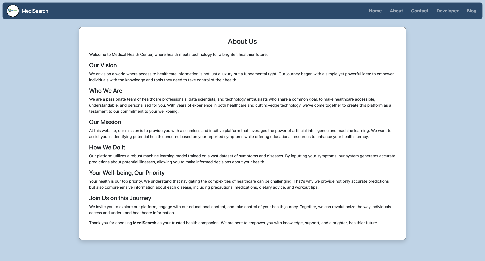
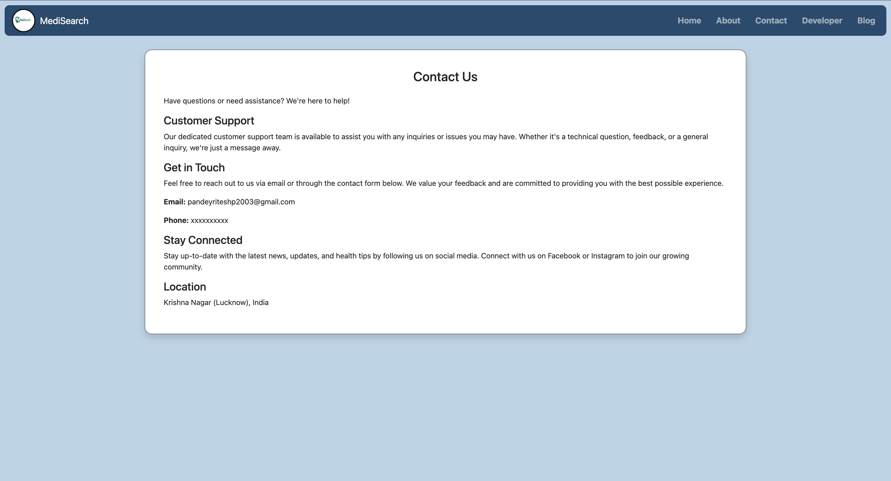
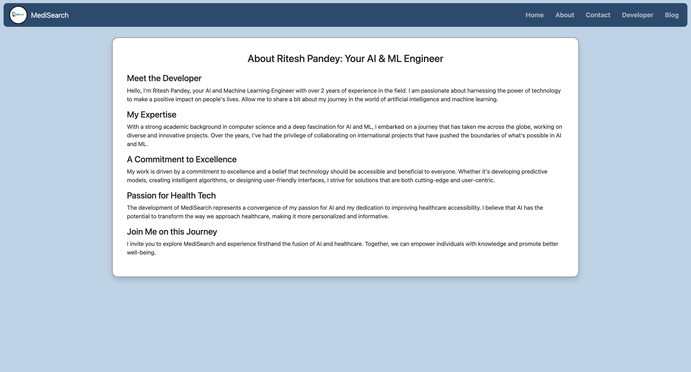
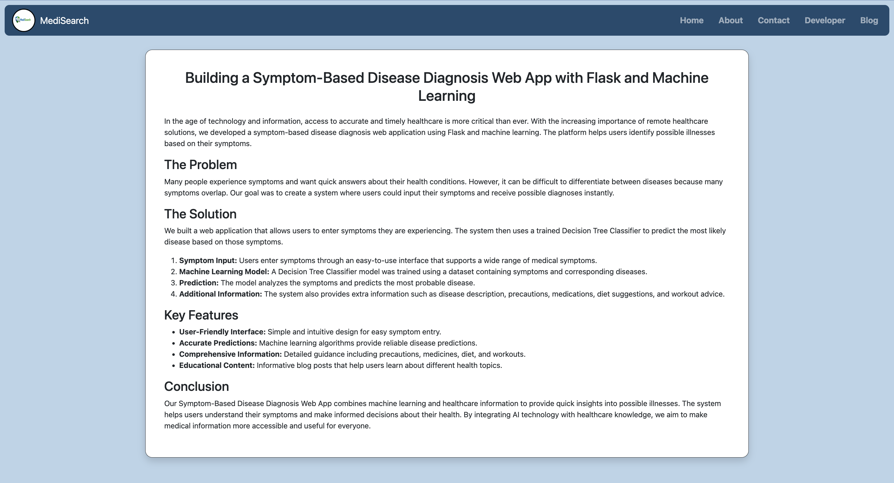

# Personalized Medical Recommendation System with Machine Learning

Welcome to our cutting-edge **Personalized Medical Recommendation System**, a powerful platform designed to assist users in understanding and managing their health.

Leveraging the capabilities of **Machine Learning**, our system analyzes **user-input symptoms** to predict potential diseases accurately and provides personalized health recommendations.

---

# MediSearch

## User Interface

  

   

The MediSearch platform provides a clean and intuitive interface where users can easily enter symptoms and receive instant AI-based medical insights.

---

## Disease Prediction System

  

The system uses trained **Machine Learning models** to analyze symptoms and predict the most probable disease.

---

## Key Features

### User-Friendly Interface
Our intuitive interface allows users to input symptoms effortlessly, ensuring a smooth and simple user experience.

### Advanced Machine Learning Models
The platform integrates powerful machine learning algorithms that analyze symptoms and predict diseases with high accuracy.

### Tailored Recommendations
Based on the predicted disease, the system provides:

- Recommended medications
- Precautionary steps
- Diet suggestions
- Workout recommendations

### Flask Web Application
The system is developed using **Flask**, enabling users to access the application easily through a web browser.

### Privacy and Security
User health data is handled with strict confidentiality, ensuring privacy and data protection.

### Continuous Improvement
As more data becomes available, the machine learning models evolve and improve prediction accuracy.

---

## System Workflow

  

 
  

  

 
 

  

 
 

  

 
 

  

 
 

  

 
 

  

 
 

  

 
 

  

 
 

  

 
 

  

 
 

1. User enters symptoms
2. Symptoms are processed by the ML model
3. Start speech recognition
4. Disease prediction is generated
5. Recommendations such as medications, diet, and precautions are provided
6. Check Home , About , Contact , Developer , Blog

---

## Technologies Used

- Python
- Flask
- Machine Learning (Scikit-learn)
- Pandas & NumPy
- HTML / CSS / Bootstrap
- JavaScript

---

## Project Goal

The goal of **MediSearch** is to provide users with intelligent healthcare guidance by using machine learning to interpret symptoms and deliver meaningful medical insights.

Our mission is to empower individuals with accessible and data-driven healthcare support.

## Developer - Ritesh Pandey

---
